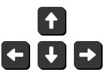

## Classic Arcade Game Clone project

Third project from the Front-End Web Developer Nanodegree in <a href="https://www.udacity.com" target="_blank">Udacity</a>:
 
recreated the classic arcade game Frogger with Object-Oriented JavaScript and HTML5 Canvas. 

### To run the application

[Project Repo](https://github.com/markchen555/Classic-Arcade-Game-Clone-Project)

Fork a copy from my github or download the repository on your computer, unzip it and open `index.html` in your browser to see the working tests. See detail in `../js/app.js`. 

---

### How to Play 

Arrow Keys :
 
Use the arrow keys from your keyboard to move your player up, right, down and left.

Goal: Try to move the main character to the water side without getting hit by the bugs. Once you reach the water side you will increase one level to your current level. Try to get as many levels as you can and compare with you friends.  

Collectibles :

Comming Soon

Enemies:

Red Bug = Your standard evil bug crossing from left to right with different speed, roughly the same size as you. Avoid them and reach the water side!

---

### Udacity's instructions

You will be provided with visual assets and a game loop engine; using these tools you must add a number of entities to the game including the player characters and enemies to recreate the classic arcade game Frogger.

---

### Reference

- [Javascript Scope](http://www.w3schools.com/js/js_scope.asp)
- [Javascript Closures](https://developer.mozilla.org/en-US/docs/Web/JavaScript/Closures)
- [Javascript This](https://developer.mozilla.org/en-US/docs/Web/JavaScript/Reference/Operators/this)
- [Javascript Protytype Chain](https://developer.mozilla.org/en-US/docs/Web/JavaScript/Inheritance_and_the_prototype_chain)
- [Javascript Decorator Pattern](https://addyosmani.com/blog/decorator-pattern/)
- [Javascript Functional Classes](http://www.thegreatcodeadventure.com/javascripts-functional-class-pattern/)
- [Javascript Prototypal Classes](http://www.w3schools.com/js/js_object_prototypes.asp)
- [Javascript Superclasses and Subclasses](http://www.javascriptkit.com/javatutors/oopjs3.shtml)
- [Javascript Pseudo Classical](http://javascript.info/tutorial/pseudo-classical-pattern)
- [HTML5 Canvas](http://www.w3schools.com/html/html5_canvas.asp)

---

### License

The project is licensed under the [MIT license](license.txt).
# Classic-Arcade-Game-Clone-Project
